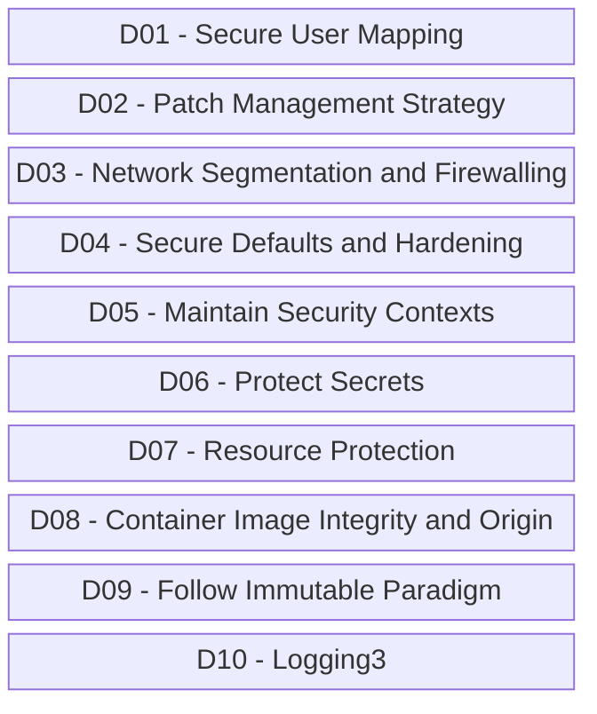

# OWASP-Docker
Conteúdos sobre segurança em containers, incluindo gráficos, vídeos, exemplos e informações da lista OWASP Docker Top 10.

## OWASP Docker Top 10

Riscos que fazem parte da **OWASP Top 10 API Security Risks - 2023**:

*ATENÇÃO: Esta lista ainda se encontra em desenvolvimento. Maiores detalhes podem ser encontrados em: https://github.com/OWASP/Docker-Security*
